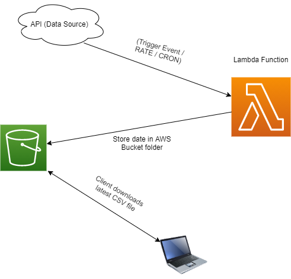

# Project Descripion
- The project consists of a lambda function that pulls covid-19 statistics about counties from the (`COVID ACT NOW`)[https://covidactnow.org/] RESTful API. The function has been deployed on AWS Lambda. It it configured to execute once everyday. The data collected from the API is stored in an public `(AWS S3 bucket)`[https://covid-data.s3.us-east-2.amazonaws.com/counties_data.csv]  

# Architechure
 

# Configuration
- Since this is public data anyone has access to this file object and they can download it.

# How to use this project
- For anyone who wants to reproduce this project, you can do so by following the instructions below:
> - Create a IAM Role on the AWS Console, give it the required permissions you can create a policy and attached it to the role.
> - $ 
> - $ pip install -r requirements.txt -t . 
> - $ zip function.zip ./
> -$ aws lambda create-function --function-name <lambda-function-name> --zip-file fileb://function.zip --handler main.main --runtime python3.6 --timeout 360 --memory-size 1024 --role arn:aws:iam::<aws-account-number>:role/<role-name> --environment Variables={API_TOKEN=<COVID-ACT-NOW-API-TOKEN>}
> - Run/Test the function
> $ aws lambda invoke --function-name <lambda-function-name> out.json
> - Create a rule for the function using AWS Cloud Watch and set it to run after every 24 hours or whenever you wish to.
> - Attach the Cloud Watch Event to the Lambda Function and everything should be setuo and good to go.

# Help is Here!
- Please reach out to @dev-mtshikomba or @pchundur for assistance.